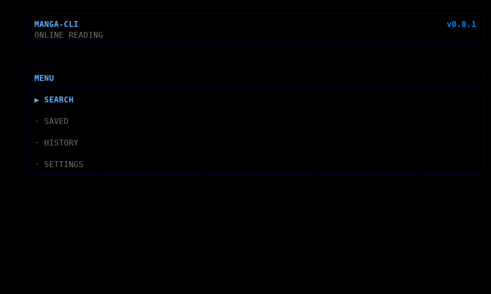
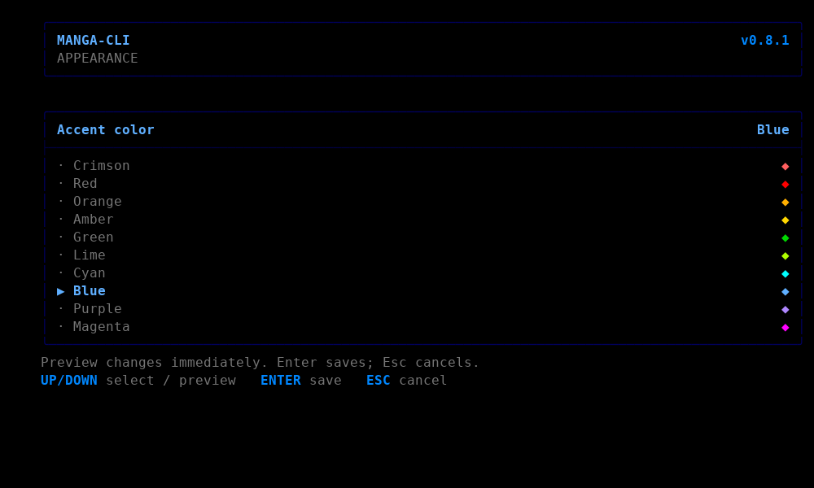

# MANGA-CLI

**A lightweight, retro terminal manga reader for Linux.**  
*a comadreja project* — inspired by [ani-cli](https://github.com/pystardust/ani-cli).

Current release: **0.8.2**. The reader keeps the stable Page/Width navigation,
source fallback and saved-progress behavior established before the public release,
while the interface and documentation are English-first and configurable.

## Preview





The screenshots show the unchanged 0.8.1/0.8.2 terminal interface with synthetic,
empty reading data. They contain no personal state or provider account information.

## Requirements

MANGA-CLI targets **Debian 12 + Xfce/X11**, Python **3.11** and mpv **0.35**.
Runtime code uses only the Python standard library; there are **no pip dependencies**,
embedded browsers, JavaScript runtimes or third-party HTML parsers.

Required system packages:

- `python3` (3.11 or newer)
- `mpv` with `gpu` or `x11` video output
- `ca-certificates` for HTTPS source connections

A UTF-8 terminal is recommended. Colors use a 256-color palette; `NO_COLOR=1` or
`TERM=dumb` disables color output.

## Install or upgrade

Download/extract the release ZIP or clone the matching release tag, then run:

```sh
bash install.sh
manga-cli
```

**Close manga-cli and its reader first. Run the installer as your normal user,
without `sudo`.** If Python, mpv or the system certificate bundle is missing on an apt-based system, `install.sh` asks `sudo` only for the package
installation (`apt-get update` + `apt-get install`) and then continues with the
per-user MANGA-CLI install. It never installs the application itself as root.

If automatic package installation is intentionally disabled, use:

```sh
MANGA_CLI_SKIP_SYSTEM_DEPS=1 bash install.sh
```

The installer requires complete `SHA256SUMS` coverage of `release-files.txt`, stages
only verified bytes, runs its offline self-test, and creates a verified private
backup before replacing managed code. Atomic directory exchange, a recovery
journal and a shared/exclusive lock protect publication; there is no delete-first
upgrade path. Unsupported filesystem operations fail without a destructive fallback.
Existing `state.json` and `settings.json` are left byte-for-byte unchanged during
installation. The public command is `manga-cli`; the legacy `manga` alias is kept
when that command name is free.

On the supported Debian 12/Xfce setup, the installer also adds one marked block to
`~/.bashrc` when Bash is the login shell so new terminal windows can find
`~/.local/bin/manga-cli`. The block is removed by `uninstall.sh` and unrelated
shell configuration is left intact. If another shell is used or the startup file
cannot be updated safely, start MANGA-CLI with:

```sh
~/.local/bin/manga-cli
```

## Interface

The main menu provides **Search**, **Saved**, **History** and **Settings**. Use
Up/Down to select, Enter to open and Esc to go back. Existing action shortcuts
remain available where shown.

### Appearance

Open **Settings -> Appearance**. Available accents are:

`Crimson / Red / Orange / Amber / Green / Lime / Cyan / Blue / Purple / Magenta`

Up/Down previews the interface immediately. Enter saves the selected accent; Esc
cancels the preview. **Crimson** is the default. Borders, titles, headings,
selection, version and decorations use the accent, while semantic success,
warning and error colors remain green, yellow and red.

The application keeps a black-background, character-frame, monospace terminal
style. It does not modify the user's terminal profile or install fonts.

### Manga information

Long titles, alternative titles, genres, sources and progress fields are rendered
on one line and truncated with `...` when needed. CJK wide/fullwidth characters
count as two terminal cells and combining marks as zero, keeping both information
columns inside the frame. The old English-only language row is intentionally absent.

## Reader controls

| Input | Action |
| --- | --- |
| `F` or `V` | Toggle **Page** / **Width** (not fullscreen) |
| `F11` | Toggle real fullscreen independently |
| Left / right click | Next / previous page |
| Page mode: wheel down / up | Next / previous page |
| Width mode: wheel, Up/Down, W/S | Vertical scroll |
| Width mode, auto edges on | Bottom advances; another upward input at top goes back |
| Left/Right, Page Up/Down | Previous / next page |
| Space | Down one screen with overlap in Width; next page in Page |
| Home / End | Top / bottom; End follows the current page-turn preference |
| A/D | Horizontal movement when needed |
| + / - | Zoom |
| R or 0 | Reset view |
| Tab | Show page/mode indicator |
| I or ? | Reader help |
| T | Retry a failed download |
| Q / Esc | Save and exit |

Going backward in Width mode opens the preceding page at its bottom. The last page
continues into the next chapter; going backward from page one can open the previous
chapter. Anti-bounce handling, saved page/position, maximized startup, `gpu`
preference and `x11` fallback are retained.

**Settings -> Reader** includes automatic edge turns, default mode, per-manga mode
memory, vertical-position saving, page indicator, 0/1/3/5-page prefetch,
next-chapter prefetch and wheel/arrow step size.

## Sources and diagnostics

Supported adapters: **MangaKatana** and **MangaPill**, with automatic/manual source
selection and configurable priority. In automatic mode, a chapter can fall back to
the other source when an equivalent chapter is available there. External sites can
change independently, so a provider parser may occasionally need maintenance.

Useful commands:

```sh
manga-cli --version
manga-cli --self-test
manga-cli --doctor
manga-cli --network-test
manga-cli --source-check "Example Title"
```

`--self-test` is offline. `--doctor` checks local dependencies and directories.
`--network-test` and `--source-check` make live requests. Review diagnostic output
before posting it publicly because local paths or title information can appear.

MANGA-CLI does not bundle source-site content and is not affiliated with
MangaKatana or MangaPill. Users are responsible for following applicable terms and
content rights.

## Data, privacy and rollback

Historical application paths remain unchanged to preserve existing installations:

```text
~/.local/lib/anticomadreja-manga/           installed code
~/.local/share/anticomadreja-manga/         state.json and settings.json
~/.cache/anticomadreja-manga/              page cache and reader diagnostics
~/.local/share/anticomadreja-manga-backups/ private installation backups
```

`XDG_DATA_HOME` and `XDG_CACHE_HOME` remain supported. Setup refuses empty,
relative, overlapping or symlinked managed data/code paths instead of guessing. MANGA-CLI does not edit global
mpv configuration, ani-cli files or terminal profiles.

The public source tree intentionally excludes reading state, settings, history,
progress, cache pages, logs, backups, environment files, credentials and personal
home paths. `python3 tools/privacy_check.py` provides an additional release guard,
but maintainers should still review staged files and Git commit metadata manually.

To roll back, run the exact `python3 .../restore.py` command printed by the
installer. The hardened restore verifies its backup, replaces only code/launchers
and keeps current reading data. It rejects the old `--restore-data` option rather
than silently overwriting newer progress.

If an installation was abruptly interrupted, recover it from the release folder:

```sh
bash install.sh --recover
```

Recovery needs Python, but no network or mpv. Keep the journal, staging copies and
private backup until recovery succeeds. See [installation safety and limitations](docs/INSTALLATION_SAFETY.md).

To uninstall code while retaining state, settings, caches and backups:

```sh
bash uninstall.sh
```

## Development

Runtime dependencies are deliberately minimal. For the full test suite on Debian,
install the development system packages:

```sh
sudo apt install python3 mpv ca-certificates liblua5.4-0 git
```

Then run:

```sh
python3 tools/privacy_check.py
python3 tools/sync_text.py --check
PYTHONDONTWRITEBYTECODE=1 python3 -m unittest discover -v
python3 manga.py --self-test
```

The repository includes GitHub Actions CI for Python 3.11 and 3.13. See
[CONTRIBUTING](CONTRIBUTING.md), [architecture](docs/ARCHITECTURE.md),
[localization](docs/LOCALIZATION.md), [manual validation](docs/MANUAL_VALIDATION.md),
[security policy](SECURITY.md) and the [release checklist](docs/RELEASE_CHECKLIST.md).

## Building a release

The release builder uses only the Python standard library. It runs the privacy and
generated-text guards, refreshes `SHA256SUMS`, runs the full tests/self-test and
packages only the exact reviewed `release-files.txt` payload into a deterministic
ZIP plus its SHA-256 file under `dist/`. Existing unrelated output files are not
deleted. Add new public source files to the allowlist explicitly after review:

```sh
python3 tools/build_release.py
```

`dist/` is ignored by Git. Before publishing, also inspect `git diff --cached`,
`git ls-files` and the commit author/email that GitHub will expose. Then verify the
actual staged filenames and bytes, including forced additions:

```sh
python3 tools/privacy_check.py --git-index
```

The safety tests run as a normal user; root is intentionally not a supported setup
test environment. See [VALIDATION.md](VALIDATION.md) for what was actually tested.

## License

MANGA-CLI is open source under the **MIT License**. See [LICENSE](LICENSE).
Third-party notes and attribution are in [THIRD_PARTY.txt](THIRD_PARTY.txt).
